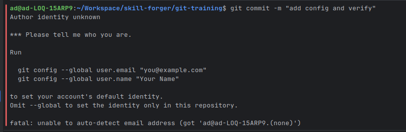
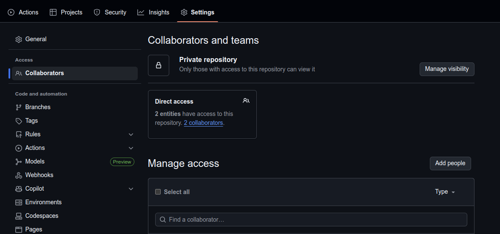
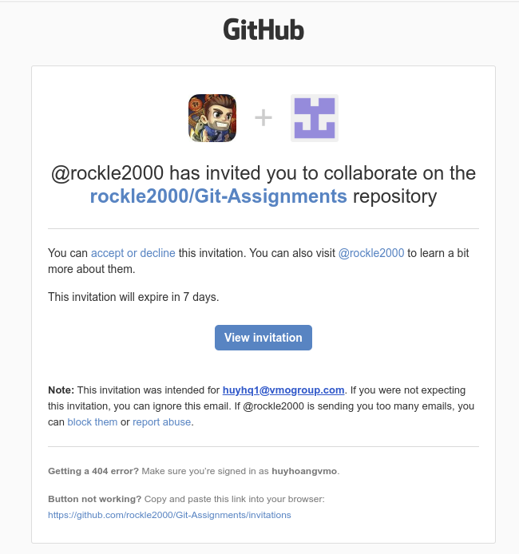
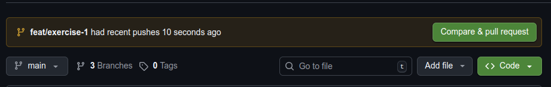
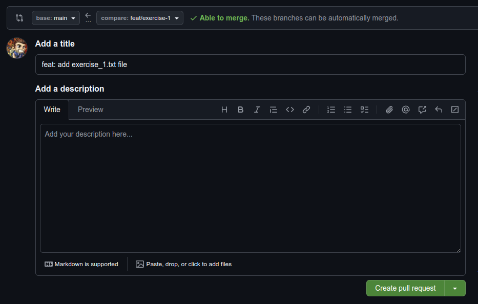
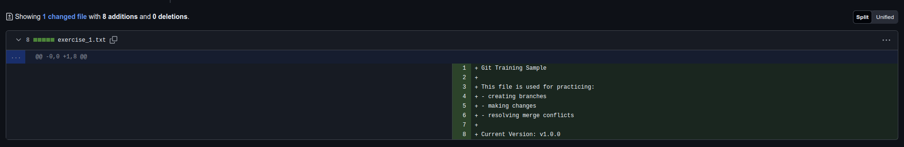
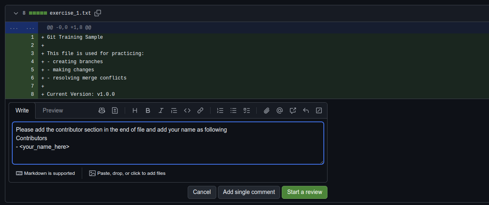
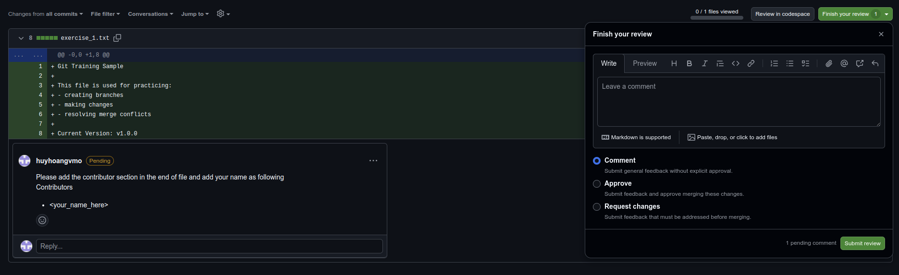

# Exercise 1 - GitHub Collaboration Fundamentals

## Description

This exercise introduces new team members to GitHub collaboration workflow. You will learn how to invite collaborators to a repository, create pull requests, and add feedback through PR comments and reviews.

## Prerequisite
Before starting this exercise, ensure you have:

- **Git** installed on your local machine
- **Two active GitHub accounts**
    - One acts as the repository owner
    - The other acts as the collaborator who receives the invitation
- **Common error (first-time commit)**
    - On your first commit, you may encounter an error message like: `"*** Please tell me who you are."`
    - This occurs because Git does not yet know your name and email address.
    - 
    - You can resolve this by configuring Git globally (see [00. Init](../00.%20Init/README.md)) or locally (see [01. Version Control](../01.%20Version%20Control/README.md))

## Use Cases
- Onboarding new developers
- Practicing basic GitHub contribution workflow
- Understanding the workflow of submitting PRs and leaving review comments
  
## Exercise Details
### 1. Invite a user to GitHub repository

**Steps:**
- Open `Settings` → `Collaborators & teams` in your repository

- Click `Add people`
- Invite teammates with their GitHub username or email
- Teammate will receive an invitation email to join the repository


### 2. Create a Pull Request

**Steps:**
- Clone repository to local machine
- Create a feature branch `feat/exercise-1` checkout from `main` branch
```
git checkout -b feat/exercise-1
```
- Add any updates (e.g: add `exercise_1.txt` file with the following content)
```
Git Training Sample

This file is used for practicing:
- creating branches
- making changes
- resolving merge conflicts

Current Version: v1.0.0
```

- Commit the changes
```
git add exercise_1.txt
git commit -m "feat: add exercise_1.txt file"
```
- Push the changes
```
git push --set-upstream origin feat/exercise-1
```

**Notes**

When pushing a new branch for the first time, Git does not know which remote branch it should connect to. Use this command to
- Pushes the branch to GitHub
- Links your local branch to the remote branch (--set-upstream)
```
git push --set-upstream origin <branch-name>
```

After this, you can simply use this command without specifying remote or branch name 
```
git push
git pull
```


- Fill out PR title and description
- Review your branch, target branch, and code changes before opening PR


- Ask your team members to review the PR

### 3. Comment on teammate’s PR

**Steps:**
- Navigate to the `Pull requests` tab inside the repository
- Select the PR and go to `Files changed` tab and review
- Add comment(s) to the PR
```
Please add the contributor section in the end of file and add your name as following
Contributors
- <your_name_here> 
```


**Note** 
- `Add single comment` → add a comment immediately and notify the author
- `Start a review` → allow you to add multiple comments and submit them together with action (Comment/Approve/Request changes)


## Expected Output
- A collaborator invitation successfully sent to your teammate
- Your teammate accepted the repository collaboration invitation
- Pull Request created and ask for your teammate’s review
- Review comments added to your teammate’s Pull Request