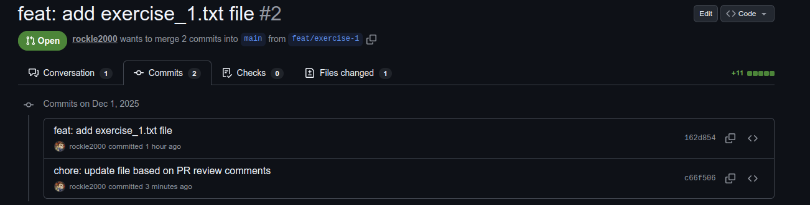
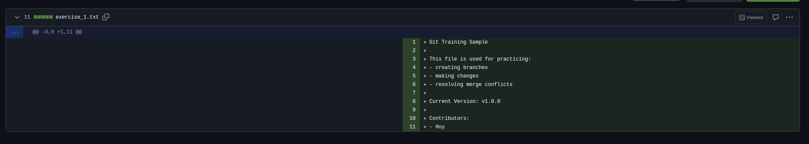
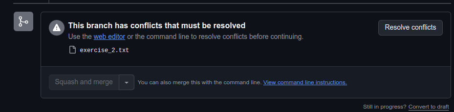
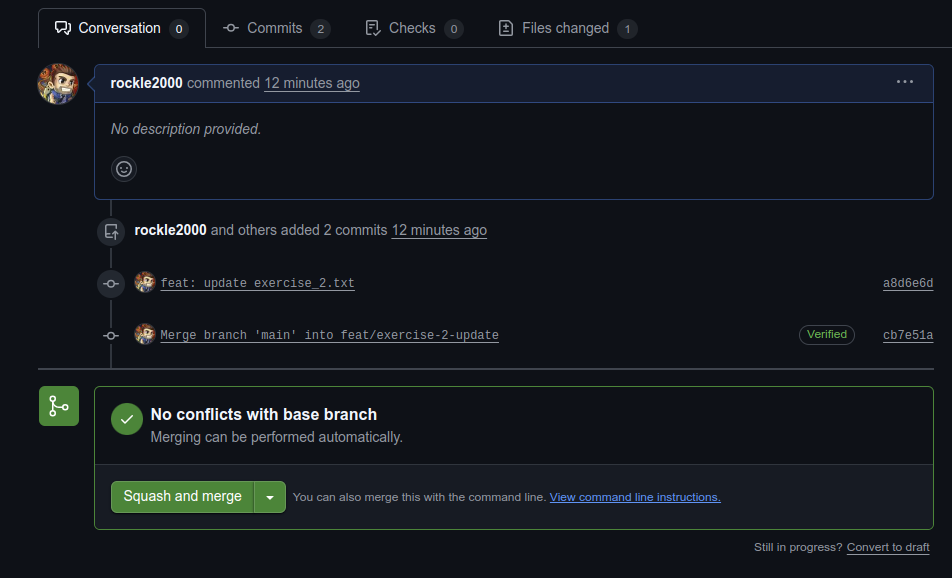
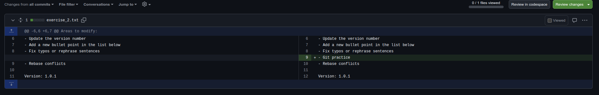
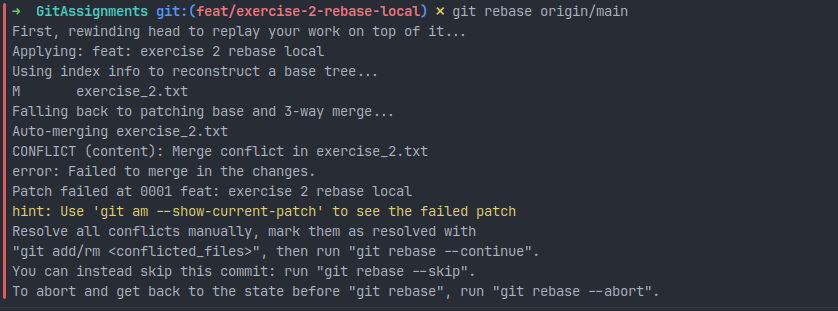

# Exercise 2 - Pull Request Updates & Conflicts Resolve

## Description

This exercise will show you how to update a Pull Request after receiving review comments and how to handle conflicts both on GitHub and locally during a rebase. These skills are essential for working with active branches and collaborating in a shared codebase.

## Prerequisite
Before starting this exercise, ensure you have
- Completed and follow all the expected output in [Exercise 1](Exercise_1.md)
- Review comments from your teammate
- Your repository cloned locally with your feature branch available

## Use Cases
- Updating a pull request after receiving feedback
- Resolving merge conflicts directly on GitHub
- Resolving conflicts that occur when rebasing a branch locally

## Exercise Details
### 1. Resolve Review Comments and Update Pull Request

**Steps:**
- Open your Pull Request on GitHub and check the review comments
- Switch back to your feature branch on your local machine
```
git checkout feat/exercise-1
```

- Apply the requested changes (example: add a Contributors section)

```
Contributors:
- <your_name_here>
```

- Commit and push the updates
```
git add exercise_1.txt
git commit -m "chore: update file based on PR review comments"
git push
```
- A new commit will be added and your changes will appear in the existing PR




- Your teammate will see new changes reflected in the PR and continue to review/merge the PR 

### 2. Resolve conflicts when Merging Pull Request (GitHub UI)

- This section simulates a merge conflict scenario created when another teammate updates the `main` branch while your PR is still open

**Steps:**
- Create `exercise_2.txt` file in main branch with following content
```
Collaboration Exercise

This file helps simulate a real collaboration workflow.

Areas to modify:
- Update the version number
- Add a new bullet point in the list below
- Fix typos or rephrase sentences

Version: 1.0.0

Changelog:
- Initial content added for Git exercises.

Contributors:
- <Your_name_here>
```

- Create a feature branch to update this file (add another bullet point in `Areas to modify`) and open the PR
```
Collaboration Exercise

This file helps simulate a real collaboration workflow.

Areas to modify:
- Update the version number
- Add a new bullet point in the list below
- Fix typos or rephrase sentences
- Git practice 

Version: 1.0.1

Changelog:
- Initial content added for Git exercises.

Contributors:
- <Your_name_here>
```
- Your teammate changes merge into `main` before your PR merged
```
Collaboration Exercise

This file helps simulate a real collaboration workflow.

Areas to modify:
- Update the version number
- Add a new bullet point in the list below
- Fix typos or rephrase sentences
- Rebase conflicts

Version: 1.0.1

Changelog:
- Initial content added for Git exercises.

Contributors:
- <Your_name_here>
```
- Open your PR and will see the conflict

- Click Resolve conflicts 
- Edit the file by fixing the conflict markers

```
<<<<<<< feat/exercise-2-update
- Git practice
=======
- Rebase conflicts
>>>>>>> main
```

- Update to final version as below, then click `Mark as resolved`
```
Areas to modify:
- Update the version number
- Add a new bullet point in the list below
- Fix typos or rephrase sentences
- Git practice
- Rebase conflicts
```

- Click `Commit merge` then it will add a merge commit in your branch, your PR will be updated and able to be merged






### 3. Resolve Conflict When Rebasing Locally

This section simulates conflict resolve while rebasing your feature branch on top of the latest `main`

**Condition**
- You previously created a Pull Request that has not been merged yet
- New changes have since been merged into the target branch (`main`)
- Your branch must be rebased to include the latest updates

**Steps:**
- Ensure you are currently on your feature branch (eg: feat/exercise-2-rebase-local)
- Fetch the latest changes from the remote repository
```
git fetch origin
```

- Rebase your feature branch on the latest `main`
```
git rebase origin/main
```

- Git will detect conflicts and pause the rebase



- Open the conflicting file and resolve the conflict markers
```
<<<<<<< HEAD
- Rebase conflicts
=======
- Rebase Local
>>>>>>> feat: exercise 2 rebase local
```

- After resolving, add the file and continue the rebase:
```
git add exercise2.txt
git rebase --continue
```

- Since rebase rewrites commit history, force-push the updated branch (**Review your changes and verify your current branch before running this command**)
```
git push --force
```

**Notes**
- Force push should only be used for the branch of your ownership, you must not force push main branch and other branches that you do not own
- The conflict marker names (HEAD vs branch name) may differ depending on your Git version and how the conflict occurred
- Always double-check which version you want to keep during conflict resolving

## Expected Output
- Pull Request updated successfully after addressing review comments
- Merge conflicts resolved through GitHub’s conflict editor
- Local rebase conflicts successfully resolved and pushed back to GitHub