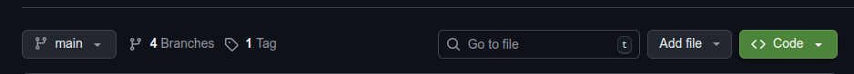
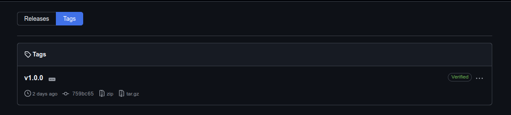
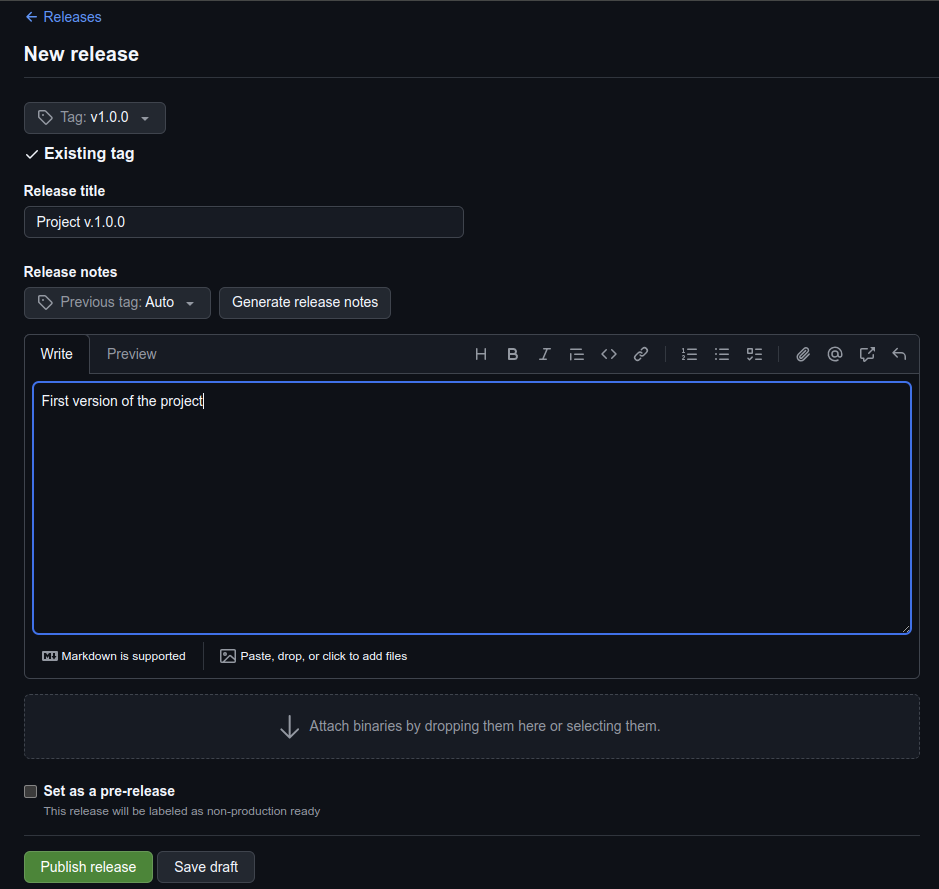

# Exercise 3 - Release Management: Tags and Release

## Description
This exercise introduces how to create version tags and publish releases.

Details for sematic versioning: [Semantic Versioning](https://semver.org/)

## Prerequisite
Before starting this exercise, ensure you have:
- Git installed on your machine and access rights to publish GitHub releases
- A repository with a main branch containing completed features
- At least one commit in main that can be tagged for release

## Use Cases
- Creating stable releases for deployment
- Documenting changes through GitHub release notes

## Exercise Details
### 1. Tag and Release a Package
Create an official release version using Git tags and GitHub Releases.

**Steps:**
- Ensure your local main branch is up to date
```
git checkout main
git pull origin main
```

- Create a tag for the release (example version: v1.0.0)
```
git tag v1.0.0
git push origin v1.0.0
```

- On GitHub, navigate to Releases → Create a new release





- Choose the tag v1.0.0 (or create it from the UI)
- Add a release title and description
- Publish the release/ Save 



## Expected Output
- A Git tag (v1.0.0) created and pushed successfully
- A published release on GitHub for version v1.0.0
