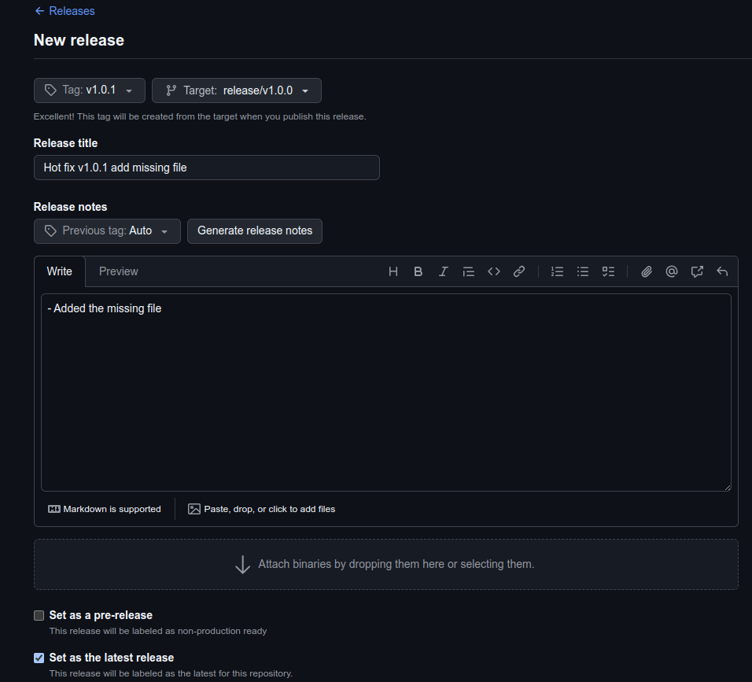

# Exercise 4 - Release Management: Cherry-Pick & Patch Versions

## Description
This exercise introduces how to cherry-pick commits into release branches, and publish patch versions. These are essential when release and applying fixes without merging all development changes into production.

## Prerequisite
Before starting this exercise, ensure you have:
- Git installed on your machine and access rights to publish GitHub releases
- Completed and follow all the expected output in [Exercise 3](Exercise_3.md)
- Another commit that will be cherry-picked to create a patch version

## Use Cases
- Applying hotfixes using cherry-pick
- Maintaining clean version history with semantic versioning (v1.0.0, v1.0.1, etc.)
- Documenting changes through GitHub release notes

## Exercise Details

### 1. Cherry-Pick a Commit to a Release Branch
Apply a specific fix to an existing release branch without merging all new development.

**Conditions**
- A commit exists on main (or another branch) that should be included in the patch release.
- A release branch already exists, e.g. release/v1.0.0

**Steps:**
- Create a release branch based on the `v1.0.0` tag
```
git checkout main
git pull origin main
git checkout -b release/v1.0.0 v1.0.0
git push origin release/v1.0.0
```

- Make a new commit on main simulating a bug fix (eg: update a file)

```
git checkout -b hotfix/add-missing-file
echo "Hotfix content" >> hotfix.txt
git add hotfix.txt
git commit -m "hotfix: add hotfix file"
git push origin hotfix/add-missing-file
```

Get this commit hash using
```
git log --oneline --graph
```


- Checkout the release branch
```
git checkout release/v1.0.0
git pull origin release/v1.0.0
```

- Cherry-pick the desired commit (Your commit hash will be different according to git log --oneline above)
```
git cherry-pick <commit-hash>
git cherry-pick 5a8d7d4
```

- If conflicts occur, resolve them then continue
```
git add <file>
git cherry-pick --continue
```

- Push the updated release branch:
```
git push origin release/v1.0
```

### 2. Create a Patch Release

Publish a new version (e.g., v1.0.1) containing only the cherry-picked fix.

**Steps:**
- Go to Releases → Draft a new release
- Create a new tag for the patch: `v1.0.1`
- Select the target branch: `release/v1.0.0`
- Add release notes describing the fix and the cherry-picked commit
- Publish the patch release




## Expected Output
- A commit successfully cherry-picked into the release branch
- A patch release (v1.0.1) created and published